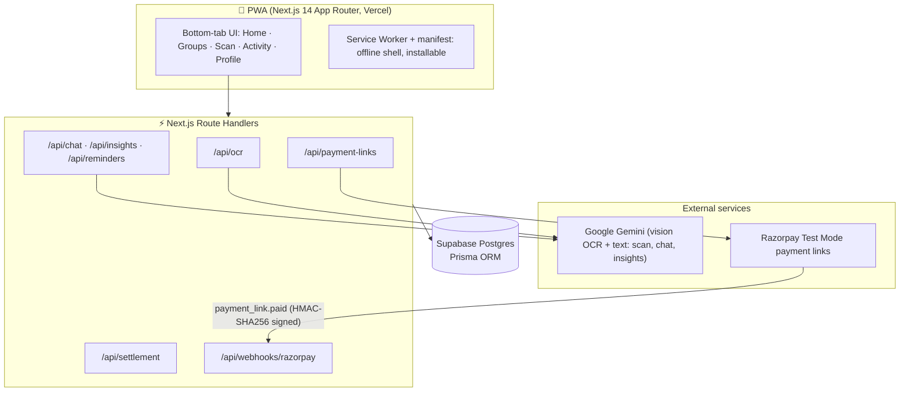

# 📱 SplitSettle AI

**Scan bills with AI. Split fairly. Settle in the fewest payments.**

A mobile-first **PWA** (installable, Add-to-Home-Screen) built with **Next.js 14 + TypeScript + Tailwind + shadcn/ui**, backed by **Supabase Postgres + Prisma**, with **Gemini** vision OCR, a **minimum-transaction settlement algorithm**, and **Razorpay test-mode payment links** with a live webhook.

> The headline: instead of naive pairwise refunds, SplitSettle computes each person's net balance and greedily matches the largest debtor to the largest creditor — collapsing an O(n²) debt graph into at most n−1 real payments. The UI shows the "before → after" so judges can see it.

---

## ✨ Features

| # | Feature | Where |
|---|---------|-------|
| 1 | Quick login (name + phone, session cookie) | `/login` |
| 2 | Create/join groups via 6-char share code | `/groups` |
| 3 | **Scan Bill** — Gemini Vision extracts vendor, total, items, date; animated confirm card | `/scan` |
| 4 | Equal / custom / **by-item** split, multi-payer | Split editor |
| 5 | **Minimum-transaction settlement** with before→after graph | Group detail |
| 6 | Razorpay payment links + **signed webhook** → live "Paid" status | `/api/webhooks/razorpay` |
| 7 | Activity feed (transaction-style, avatars, pull-to-refresh) | `/activity` |
| 8 | **AI Spending Coach** chat grounded in real DB data (never invents numbers) | Group detail |
| 9 | **Auto-categorization** (Food/Travel/Rent/Utilities/Shopping) with colored chips | Scan flow |
| 10 | **Anomaly detection** — "40% above usual" warning before confirming | Scan flow |
| 11 | **Smart reminders** — Gemini-written nudges, tone scales gentle→firm with age | Group detail |
| 12 | **Monthly recap** shareable card | Group detail |
| 13 | **Fair-split forecast** — "at this rate you'll owe ~₹X by month end" | `/home` |

Everything degrades gracefully: no Gemini key → manual entry + keyword categories + template insights. No Razorpay keys → mock payment links. The app is always demoable.

---

## 🏗️ Architecture



**Settlement engine** (`lib/settlement-algorithm.ts`): net balance per person → sort creditors/debtors by magnitude → greedily settle largest-vs-largest → at most n−1 transfers.

## 🚀 Run locally (5 minutes)

```bash
# 1. Install
npm install

# 2. Configure env
cp .env.example .env        # then paste your keys (table below)

# 3. Create the database schema
npx prisma db push

# 4. Run
npm run dev                 # → http://localhost:3000
```

Open it on your phone via your LAN IP (e.g. `http://192.168.x.x:3000`) for the real native-app feel, and use your browser's **"Add to Home Screen"** to install it.

### Environment variables

| Variable | Where to get it | Required? |
|----------|----------------|-----------|
| `DATABASE_URL` | Supabase → Project Settings → Database → Connection string (URI) | ✅ |
| `SESSION_SECRET` | Any long random string (`openssl rand -hex 32`) | ✅ |
| `GEMINI_API_KEY` | [Google AI Studio](https://aistudio.google.com/apikey) — free tier | Recommended |
| `GEMINI_MODEL` | Defaults to `gemini-1.5-flash` | Optional |

| `RAZORPAY_KEY_ID` / `RAZORPAY_KEY_SECRET` | Razorpay Dashboard → Settings → API Keys → **Test mode** (`rzp_test_…`) | For real links |
| `RAZORPAY_WEBHOOK_SECRET` | You choose it when creating the webhook (see below) | For live settling |
| `NEXT_PUBLIC_APP_URL` | `http://localhost:3000` locally, your Vercel URL in prod | ✅ |

> No keys at all? The app still runs: OCR falls back to a manual form, categories come from a keyword classifier, and payment links are simulated. Great for UI rehearsal.

## 📧 Automatic email reminders (Gmail API)

The instant a bill is split and payment links are generated, the server **automatically** emails every debtor — no button click needed. Each email is written by Gemini (tone scales with how overdue the debt is: gentle on day 1, firmer by day 5+), formatted as clean HTML with the group name, exact amount owed and a **Pay Now** button linking to the Razorpay payment link.

**How it works:**
- Uses the **Gmail API** with the `gmail.send` OAuth scope — no third-party email service needed.
- Emails are sent **from the bill-creator's own connected Gmail account** (whoever saved the split sends the reminder as themselves), not from a shared app account.
- Delivery is tracked per debt (`EmailLog`): the group screen shows "✅ Emailed" / "❌ Failed to send" with the reason.

**Setup:**
1. In Google Cloud Console → **APIs & Services → Library**, enable the **Gmail API**.
2. In **OAuth consent screen → Scopes**, add `https://www.googleapis.com/auth/gmail.send` (alongside `.../gmail.readonly` if you use Passive Bill Detection).
3. Create an **OAuth Client ID** (type: Web application) and set the env vars:

| Variable | Value |
|----------|-------|
| `GOOGLE_CLIENT_ID` | OAuth Client ID from Cloud Console |
| `GOOGLE_CLIENT_SECRET` | OAuth Client Secret |
| `GOOGLE_REDIRECT_URI` | `http://localhost:3000/api/google/callback` (or your deployed URL + `/api/google/callback`) |

4. Each sender connects Gmail once from **Profile → Connect Gmail** (Google re-prompts whenever a new scope like `gmail.send` is added).

**Gmail not connected?** Nothing breaks — the app falls back to showing the same personalized nudge inside the group screen with a "Copy message" button so you can send it manually.

---

## ☁️ Deploy to Vercel + Supabase
1. **Supabase** (free): create a project → copy the **Connection string (URI)**.
2. **Push this repo to your GitHub.**
3. **Vercel**: "New Project" → import the repo → add the env vars from the table above (use Supabase's **connection pooling** URI, port `6543`, for `DATABASE_URL`).
4. Deploy. Then create the DB schema once from your machine:
   ```bash
   DATABASE_URL="<your-supabase-uri>" npx prisma db push
   ```
5. **Razorpay webhook**: Dashboard → Settings → Webhooks → add `https://<your-app>.vercel.app/api/webhooks/razorpay`, subscribe to **`payment_link.paid`**, set a secret → paste the same secret as `RAZORPAY_WEBHOOK_SECRET` in Vercel → redeploy.

Every `git push` to `main` now redeploys automatically. No other manual steps.

---

## 🧪 Demo script (90 seconds that win)

1. Scan a real receipt → watch Gemini extract vendor/items/date and the fields animate in.
2. Notice the anomaly chip on a big bill ("60% above usual").
3. Assign payers, save → activity feed updates.
4. Open **Settle up** → the before→after graph shows 9 possible payments collapsing to 2.
5. Tap "Create payment links" → real Razorpay test links; pay one on your phone → webhook flips it to ✅ live.
6. Ask the AI Coach "how much did we spend on food this month?" — grounded, real numbers.
7. Show the monthly recap card and the fair-split forecast.

---

## 📁 Structure

```
app/
  (tabs)/            home · groups · scan · activity · profile (bottom-nav shell)
  api/               ocr · bills · settlement · payment-links · webhooks/razorpay · chat · insights · reminders · activity · groups · session
components/          bottom-nav · bottom-sheet · chat-sheet · recap-card · settlement-graph · screens/* · ui/*
lib/                 prisma · gemini · razorpay · settlement-algorithm · categorize · insights · session · api
prisma/schema.prisma User · Group · Membership · Bill · BillShare · Debt · Activity
public/              manifest.json · sw.js · icons
```

## 🛠️ Tech stack

Next.js 14 (App Router) · TypeScript · Tailwind CSS · shadcn/ui patterns · Framer Motion · lucide-react · Prisma + Supabase Postgres · Google Gemini (`@google/generative-ai`) · Razorpay Node SDK (test mode) · next-themes (dark mode) · PWA manifest + service worker.


