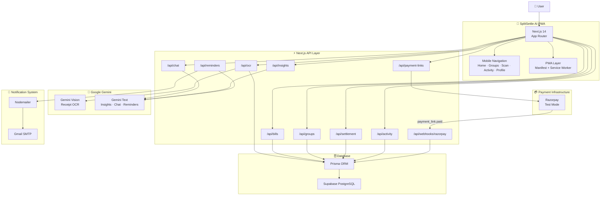
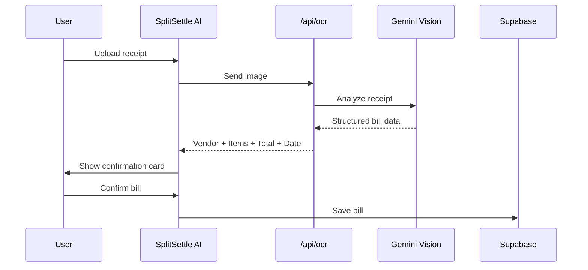
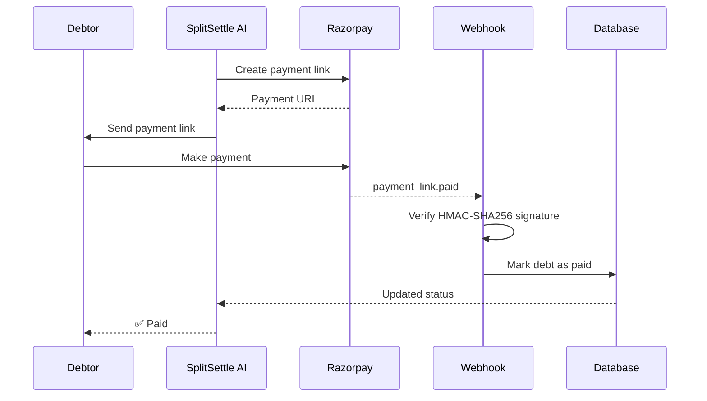
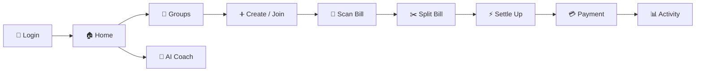

# 📱 SplitSettle AI

### Scan bills with AI. Split fairly. Settle with fewer payments.

<p align="center">
  <strong>AI-powered bill splitting and smart group settlement</strong>
</p>

<p align="center">
  <a href="https://splite-settle-ai-bk3165843-5971s-projects.vercel.app">
    
  </a>
  <a href="https://splite-settle-ai-bk3165843-5971s-projects.vercel.app">
    
  </a>
</p>

<p align="center">
  <a href="https://splite-settle-ai-bk3165843-5971s-projects.vercel.app">
    
  </a>
</p>

---

## ✨ Overview

**SplitSettle AI** is a mobile-first Progressive Web App that makes group bill splitting simple, fair, and intelligent.

Instead of manually calculating who owes whom, SplitSettle AI can:

* 📸 Scan a real receipt using Gemini Vision
* 🤖 Extract bill details automatically
* 👥 Split expenses equally, by custom amounts, or by individual items
* 🧮 Calculate each person's net balance
* ⚡ Minimize the number of payments required to settle the group
* 💳 Generate Razorpay payment links
* 📧 Automatically send payment reminders
* 🧠 Provide AI-powered spending insights
* 🚨 Detect unusual spending
* 📊 Generate monthly spending recaps
* 📱 Work as an installable PWA

> **The core idea:**
> Turn a complicated group debt graph into the smallest possible set of real-world payments.

### 🔗 Live Application

**Try SplitSettle AI:**
https://splite-settle-ai-bk3165843-5971s-projects.vercel.app

No signup is required for the demo.

---

# 🎯 Why SplitSettle AI?

Traditional bill-splitting applications often create unnecessary transactions.

For example, imagine a group where:

```text
Alice → Bob       ₹500
Alice → Charlie   ₹300
David → Bob       ₹200
David → Charlie   ₹100
```

There may be many individual transactions.

SplitSettle AI first calculates everyone's **net balance** and then matches debtors with creditors.

```text
BEFORE

Alice ───── ₹500 ────→ Bob
Alice ───── ₹300 ────→ Charlie
David ───── ₹200 ────→ Bob
David ───── ₹100 ────→ Charlie


AFTER

Alice ───── ₹800 ────→ Bob
David ───── ₹300 ────→ Charlie
```

The result is fewer payments and a much simpler settlement process.

---

# 🚀 Key Features

| #  | Feature                 | Description                                                   |
| -- | ----------------------- | ------------------------------------------------------------- |
| 01 | 🔐 Quick Login          | Login using name and phone with session-based authentication  |
| 02 | 👥 Groups               | Create or join groups using a 6-character share code          |
| 03 | 📸 AI Bill Scanner      | Gemini Vision extracts vendor, date, items and total          |
| 04 | 💰 Smart Splitting      | Equal, custom and item-level splitting                        |
| 05 | 🧮 Multi-Payer Support  | Multiple members can pay for the same bill                    |
| 06 | ⚡ Smart Settlement      | Minimizes the number of required transactions                 |
| 07 | 💳 Razorpay Payments    | Generate payment links using Razorpay                         |
| 08 | 🔔 Live Payment Status  | Razorpay webhook updates payment status automatically         |
| 09 | 📧 Email Reminders      | Automatically emails debtors with personalized payment links  |
| 10 | 🤖 AI Spending Coach    | Ask questions about real group spending                       |
| 11 | 🏷️ Auto Categorization | Automatically categorizes expenses                            |
| 12 | 🚨 Anomaly Detection    | Detects unusually high expenses                               |
| 13 | 🔔 Smart Reminders      | AI-generated reminders based on payment age                   |
| 14 | 📊 Monthly Recap        | Generates shareable monthly spending summaries                |
| 15 | 📈 Fair-Split Forecast  | Estimates expected spending and future contribution           |
| 16 | 📱 PWA                  | Installable directly from a mobile browser                    |
| 17 | 🌙 Dark Mode            | Modern dark/light interface                                   |
| 18 | 📶 Graceful Fallbacks   | Core functionality continues without optional AI/payment APIs |

---

# 🏗️ Architecture



---

# 🧠 Core Settlement Algorithm

The main intelligence behind SplitSettle AI is the **minimum-transaction settlement algorithm**.

Instead of preserving every individual debt relationship, the system calculates a **net balance** for every group member.

### Step 1 — Calculate Net Balance

For every person:

```text
Net Balance = Amount Paid - Amount Owed
```

Example:

```text
Alice    +₹800
Bob      +₹300
Charlie  -₹700
David    -₹400
```

Positive values represent **creditors**.

Negative values represent **debtors**.

---

### Step 2 — Separate Creditors and Debtors

```text
Creditors

Alice     ₹800
Bob       ₹300


Debtors

Charlie   ₹700
David     ₹400
```

---

### Step 3 — Greedy Matching

The algorithm repeatedly matches:

```text
Largest Debtor
        ↓
Largest Creditor
        ↓
Transfer the minimum possible amount
        ↓
Remove anyone whose balance reaches zero
```

Example:

```text
Charlie → Alice    ₹700

Remaining:

Alice     ₹100
Bob       ₹300
David    -₹400

David → Bob        ₹300

David → Alice      ₹100
```

The algorithm produces only the transactions necessary to settle the final balances.

### Complexity

The original debt graph can contain **O(n²)** relationships.

The settlement process reduces this to at most:

```text
n - 1 transactions
```

The implementation is located in:

```text
lib/settlement-algorithm.ts
```

---

# 📸 AI Bill Scanning

SplitSettle AI uses **Gemini Vision** to analyze receipt images.

### Scan Flow



Gemini can extract:

```text
Vendor
Date
Total Amount
Individual Items
Prices
Potential Category
```

The user can review and edit the extracted information before saving.

---

# 🏷️ Automatic Categorization

Expenses are automatically classified into categories such as:

```text
🍔 Food
✈️ Travel
🏠 Rent
💡 Utilities
🛍️ Shopping
```

If Gemini is unavailable, SplitSettle AI falls back to a lightweight keyword-based classifier.

This means the application remains usable even without an AI API key.

---

# 🚨 Anomaly Detection

SplitSettle AI compares new expenses against historical spending patterns.

For example:

```text
⚠️ Unusual Expense

This bill is approximately 40%
higher than your group's usual spending.
```

The warning appears before the user confirms the bill.

This helps users catch:

* Accidental duplicate bills
* Unexpectedly expensive purchases
* Incorrect receipt totals
* Unusual spending patterns

---

# 🤖 AI Spending Coach

The AI Spending Coach can answer questions using actual group data.

Example:

```text
User:
"How much did we spend on food this month?"

AI:
"Your group spent ₹8,450 on food this month."
```

The important design principle is:

> **The AI should reason over real database values instead of inventing financial numbers.**

---

# 💳 Razorpay Payment Flow

SplitSettle AI integrates Razorpay payment links.



### Webhook Endpoint

```text
/api/webhooks/razorpay
```

The webhook validates Razorpay's signed payload before updating the database.

---

# 📧 Automatic Email Reminders

When payment links are generated, SplitSettle AI can automatically notify debtors.

The system uses:

```text
Nodemailer
      ↓
Gmail SMTP
      ↓
Debtor Email
      ↓
Razorpay Payment Link
```

Emails contain:

* Group name
* Exact amount owed
* Personalized reminder
* Payment link
* "Pay Now" button

Reminder tone can become progressively firmer based on how long the debt remains unpaid.

Example:

```text
Day 1
"Hey! Just a quick reminder about your pending split 😊"

Day 5+
"Your payment of ₹850 is still pending.
Please settle it when you get a chance."
```

Email delivery is tracked through:

```text
EmailLog
```

The group interface can show:

```text
✅ Emailed

or

❌ Failed to send
```

---

# 📱 Progressive Web App

SplitSettle AI is designed as a **mobile-first PWA**.

Users can install it directly from their browser:

```text
Browser
   ↓
Add to Home Screen
   ↓
📱 SplitSettle AI
```

The PWA includes:

* Installable application
* Mobile-first UI
* App-like navigation
* Service worker
* Offline shell
* Responsive layouts
* Bottom-tab navigation
* Dark mode

---

# 🗺️ Application Flow



---

# 🛠️ Tech Stack

## Frontend

| Technology              | Purpose                       |
| ----------------------- | ----------------------------- |
| Next.js 14              | React framework               |
| TypeScript              | Type-safe development         |
| Tailwind CSS            | Styling                       |
| shadcn/ui               | UI components                 |
| Framer Motion           | Animations                    |
| Lucide React            | Icons                         |
| React / Next App Router | Application routing           |
| PWA                     | Installable mobile experience |

## Backend

| Technology             | Purpose                 |
| ---------------------- | ----------------------- |
| Next.js Route Handlers | API layer               |
| Prisma                 | ORM                     |
| Supabase PostgreSQL    | Database                |
| Session Cookies        | Authentication          |
| Webhooks               | Payment synchronization |
| Nodemailer             | Email delivery          |

## AI

| Technology           | Purpose                    |
| -------------------- | -------------------------- |
| Google Gemini Vision | Receipt OCR                |
| Google Gemini Text   | AI Coach                   |
| Gemini               | Spending insights          |
| Gemini               | Smart reminders            |
| Keyword Classifier   | AI fallback categorization |

## Payments

| Technology  | Purpose              |
| ----------- | -------------------- |
| Razorpay    | Payment links        |
| HMAC-SHA256 | Webhook verification |

## Deployment

```text
Vercel
   +
Supabase
   +
Razorpay
   +
Google Gemini
```

---

# 📁 Project Structure

```text
splitsettle-ai/
│
├── app/
│   ├── (tabs)/
│   │   ├── home/
│   │   ├── groups/
│   │   ├── scan/
│   │   ├── activity/
│   │   └── profile/
│   │
│   ├── api/
│   │   ├── ocr/
│   │   ├── bills/
│   │   ├── groups/
│   │   ├── settlement/
│   │   ├── payment-links/
│   │   ├── webhooks/
│   │   │   └── razorpay/
│   │   ├── chat/
│   │   ├── insights/
│   │   ├── reminders/
│   │   ├── activity/
│   │   └── session/
│   │
│   └── layout.tsx
│
├── components/
│   ├── bottom-nav/
│   ├── bottom-sheet/
│   ├── chat-sheet/
│   ├── recap-card/
│   ├── settlement-graph/
│   ├── screens/
│   └── ui/
│
├── lib/
│   ├── prisma.ts
│   ├── gemini.ts
│   ├── razorpay.ts
│   ├── settlement-algorithm.ts
│   ├── categorize.ts
│   ├── insights.ts
│   ├── session.ts
│   └── api.ts
│
├── prisma/
│   └── schema.prisma
│
├── public/
│   ├── manifest.json
│   ├── sw.js
│   └── icons/
│
├── .env.example
├── package.json
├── next.config.js
├── tailwind.config.ts
└── README.md
```

---

# ⚙️ Database Model

The core Prisma schema contains entities such as:

```text
User
  │
  ├── Membership
  │       │
  │       └── Group
  │
  ├── Bill
  │       │
  │       └── BillShare
  │
  └── Activity

Group
  │
  ├── Members
  ├── Bills
  ├── Debts
  └── Activities
```

### Main entities

```text
User
Group
Membership
Bill
BillShare
Debt
Activity
EmailLog
```

---

# 🚀 Run Locally

### 1. Clone the repository

```bash
git clone <your-repository-url>
cd splitsettle-ai
```

### 2. Install dependencies

```bash
npm install
```

### 3. Configure environment variables

```bash
cp .env.example .env
```

Add your credentials to `.env`.

### 4. Create the database schema

```bash
npx prisma db push
```

### 5. Start the development server

```bash
npm run dev
```

Open:

```text
http://localhost:3000
```

For testing the native mobile experience, access the application using your computer's LAN IP:

```text
http://192.168.x.x:3000
```

Then use your browser's **Add to Home Screen** option.

---

# 🔑 Environment Variables

Create a `.env` file:

```env
DATABASE_URL="your_supabase_database_url"

SESSION_SECRET="your_random_session_secret"

GEMINI_API_KEY="your_gemini_api_key"
GEMINI_MODEL="gemini-1.5-flash"

RAZORPAY_KEY_ID="rzp_test_xxxxxxxxx"
RAZORPAY_KEY_SECRET="your_razorpay_secret"
RAZORPAY_WEBHOOK_SECRET="your_webhook_secret"

NEXT_PUBLIC_APP_URL="http://localhost:3000"

NOTIFICATION_EMAIL="your_notification_email@gmail.com"
NOTIFICATION_EMAIL_APP_PASSWORD="your_gmail_app_password"
```

### Required vs Optional

| Variable                          |    Required | Purpose                   |
| --------------------------------- | ----------: | ------------------------- |
| `DATABASE_URL`                    |           ✅ | Supabase PostgreSQL       |
| `SESSION_SECRET`                  |           ✅ | Secure sessions           |
| `GEMINI_API_KEY`                  | Recommended | AI OCR and intelligence   |
| `GEMINI_MODEL`                    |    Optional | Gemini model selection    |
| `RAZORPAY_KEY_ID`                 |    Optional | Payment links             |
| `RAZORPAY_KEY_SECRET`             |    Optional | Razorpay authentication   |
| `RAZORPAY_WEBHOOK_SECRET`         |    Optional | Webhook verification      |
| `NEXT_PUBLIC_APP_URL`             |           ✅ | Application URL           |
| `NOTIFICATION_EMAIL`              |    Optional | Reminder sender           |
| `NOTIFICATION_EMAIL_APP_PASSWORD` |    Optional | Gmail SMTP authentication |

---

# ☁️ Deployment

## Deploy with Vercel + Supabase

### 1. Create Supabase project

Create a PostgreSQL database and obtain the connection URI.

### 2. Push the repository to GitHub

```bash
git add .
git commit -m "Initial SplitSettle AI release"
git push origin main
```

### 3. Import into Vercel

Connect the GitHub repository to Vercel.

Add the required environment variables under:

```text
Vercel
→ Project
→ Settings
→ Environment Variables
```

### 4. Configure Prisma

Use the Supabase connection pooling URI where appropriate.

Then run:

```bash
DATABASE_URL="your-supabase-uri" npx prisma db push
```

### 5. Configure Razorpay webhook

Create a webhook pointing to:

```text
https://YOUR-DOMAIN/api/webhooks/razorpay
```

Subscribe to:

```text
payment_link.paid
```

Set the same webhook secret in:

```text
RAZORPAY_WEBHOOK_SECRET
```

After deployment, every push to the configured production branch can trigger a new Vercel deployment.

---

# 🧪 Demo Flow

The recommended 90-second demonstration:

### 1️⃣ Scan a real receipt

Upload a receipt and demonstrate Gemini extracting:

```text
Vendor
Date
Items
Total
Category
```

### 2️⃣ Show anomaly detection

Demonstrate the warning:

```text
⚠️ 60% above usual spending
```

### 3️⃣ Split the bill

Assign members and choose:

```text
Equal
Custom
By Item
Multi-Payer
```

### 4️⃣ Open Settle Up

Show the:

```text
BEFORE → AFTER
```

settlement graph.

Example:

```text
9 possible transactions
        ↓
2 optimized transactions
```

### 5️⃣ Generate payment links

Create Razorpay test payment links.

### 6️⃣ Complete a payment

Make a test payment and demonstrate the webhook automatically changing:

```text
⏳ Pending
      ↓
✅ Paid
```

### 7️⃣ Ask the AI Coach

Example:

```text
"How much did we spend on food this month?"
```

### 8️⃣ Show insights

Demonstrate:

* Monthly recap
* Spending categories
* Fair-split forecast
* Smart reminders

---

# 🛡️ Graceful Fallbacks

SplitSettle AI is designed so optional services do not completely break the application.

### Gemini unavailable

```text
Gemini
  ↓
Unavailable
  ↓
Manual bill entry
  +
Keyword categorization
  +
Template insights
```

### Razorpay unavailable

```text
Razorpay
  ↓
Unavailable
  ↓
Debt remains visible
  +
Manual settlement option
```

### Email unavailable

```text
Email
  ↓
Failed / Not configured
  ↓
Personalized reminder shown in app
  +
Copy Message
```

This keeps the core bill-splitting experience functional even when external services are unavailable.

---

# 🔐 Security Considerations

SplitSettle AI uses several security practices:

* Environment variables for secrets
* Session-based authentication
* Server-side API operations
* Razorpay webhook signature verification
* HMAC-SHA256 validation
* Database-backed payment state
* No API secrets exposed to the client
* Server-side Gemini requests
* Input validation
* Controlled payment state transitions

> **Never commit `.env` or API credentials to GitHub.**

Add the following to `.gitignore`:

```text
.env
.env.local
.env.production
node_modules/
.next/
```

---

# 📈 Performance & Scalability

The architecture is designed around serverless-friendly services:

```text
Vercel
   ↓
Next.js Route Handlers
   ↓
Prisma
   ↓
Supabase PostgreSQL
```

Potential scaling improvements include:

* Redis caching
* Background job queues
* Database connection pooling
* Rate limiting
* Image compression before OCR
* AI response caching
* Pagination for activity feeds
* Indexed financial queries

---

# 🔮 Future Improvements

Planned improvements could include:

* [ ] Google / Apple authentication
* [ ] WhatsApp payment reminders
* [ ] UPI deep links
* [ ] Recurring bills
* [ ] Group expense analytics
* [ ] Advanced spending predictions
* [ ] Multi-currency support
* [ ] Currency conversion
* [ ] Receipt history
* [ ] Export to PDF / CSV
* [ ] Push notifications
* [ ] Redis caching
* [ ] Background processing
* [ ] Advanced fraud/anomaly detection
* [ ] AI-powered financial recommendations

---

# 🏆 What Makes SplitSettle AI Different?

SplitSettle AI combines several technologies into one practical financial workflow:

```text
Receipt Image
      ↓
🤖 AI Vision
      ↓
Structured Bill
      ↓
👥 Smart Split
      ↓
🧮 Net Balance Calculation
      ↓
⚡ Minimum Transactions
      ↓
💳 Payment Links
      ↓
🔔 Webhook Confirmation
      ↓
📧 Automated Reminder
      ↓
📊 Spending Intelligence
```

Instead of being only a **bill calculator**, SplitSettle AI creates an end-to-end expense settlement system.

---

# 📊 Project Highlights

```text
📱 Mobile-first PWA
🤖 Gemini Vision OCR
🧮 Minimum-transaction settlement
💳 Razorpay payment integration
🔔 Real-time webhook updates
📧 Automated email reminders
📊 AI spending analytics
🚨 Anomaly detection
🏷️ Automatic categorization
⚡ Graceful API fallbacks
☁️ Vercel + Supabase deployment
```

---

# 📜 License

This project is developed for educational, portfolio, hackathon, and demonstration purposes.

---

<p align="center">

### 🚀 SplitSettle AI

**Scan bills. Split fairly. Settle smarter.**

Built with ❤️ using Next.js, TypeScript, Supabase, Prisma, Gemini AI and Razorpay.

</p>
